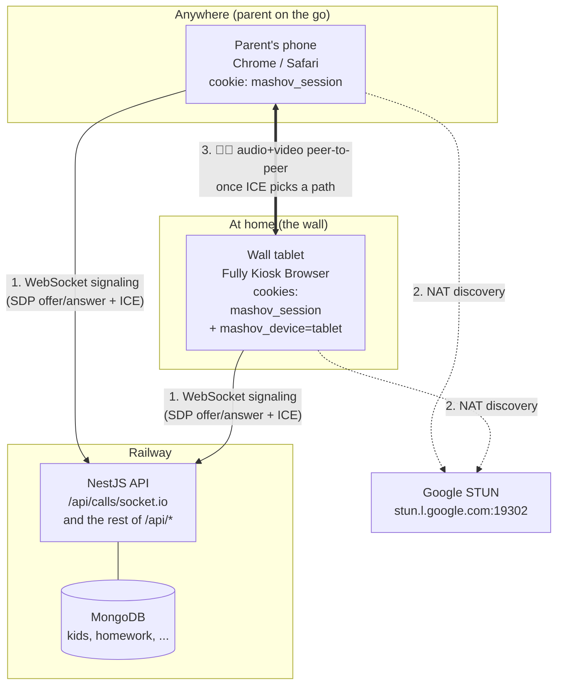
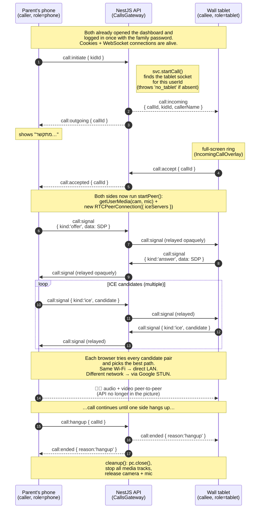

# Video calling — how the call finds the right device

## Architecture (one picture)



The NestJS API only relays a few JSON messages to set up the connection.
**Once the call is connected, the media (camera + microphone) flows directly
between phone and tablet — the server is no longer involved.**

## How the API knows which device to ring

When either device opens the dashboard and the WebSocket connects:

1. The handshake sends the `mashov_session` cookie. The gateway verifies the
   JWT and pulls `userId` out of it (one family = one userId).
2. The query string carries `?role=tablet` or `?role=phone`. The wall tablet
   becomes `tablet`; everything else is `phone` (set by the `mashov_device`
   cookie that `DeviceRoleSetter` writes the first time the URL had
   `?device=tablet`).
3. The gateway adds the socket to its in-memory registry:

```
byUser["family-1"] = {
  tablet:  "socket_abc123",       ← the wall tablet
  phones:  { "socket_xyz789" },   ← the parent's phone
}
```

When the phone emits `call:initiate`, the gateway looks up
`byUser[userId].tablet` and emits `call:incoming` to that socket.
That's the whole "routing" — a Map lookup by `userId`, then by role.

## Sequence — what fires when you tap 📞 התקשר



## The two questions this answers

- **"How does my phone know which tablet to ring?"**
  Both devices share the family `userId` (same login). The gateway keeps a
  map `userId → { tablet, phones }`. Initiate from `phones` → ring `tablet`.

- **"Why is video fast even though my data goes through Railway?"**
  It doesn't, for the video. Railway only sees the call-setup messages
  (a few hundred bytes). The actual stream goes directly between the two
  browsers using whichever network path STUN/ICE discovers — usually the
  same Wi-Fi when you're home, the public internet via NAT punching when
  you're away. The server bandwidth cost is constant regardless of call
  duration or quality.
